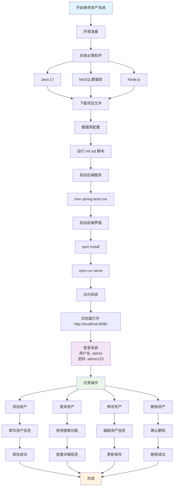

```mermaid
graph TD
    A[开始使用资产系统] --> B[环境准备]
    B --> C[安装必需软件]
    C --> D[Java 17]
    C --> E[MySQL数据库]
    C --> F[Node.js]
    
    D --> G[下载项目文件]
    E --> G
    F --> G
    
    G --> H[数据库配置]
    H --> I[运行 init.sql 脚本]
    I --> J[启动后端服务]
    J --> K[mvn spring-boot:run]
    
    K --> L[启动前端界面]
    L --> M[npm install]
    M --> N[npm run serve]
    
    N --> O[访问系统]
    O --> P[浏览器打开 http://localhost:8080]
    P --> Q[登录系统<br/>用户名: admin<br/>密码: admin123]
    
    Q --> R[日常操作]
    R --> S[添加资产]
    R --> T[查询资产]
    R --> U[修改资产]
    R --> V[删除资产]
    
    S --> W[填写资产信息]
    W --> X[保存成功]
    
    T --> Y[使用搜索功能]
    Y --> Z[查看详细信息]
    
    U --> AA[编辑资产信息]
    AA --> AB[更新保存]
    
    V --> AC[确认删除]
    AC --> AD[删除成功]
    
    X --> AE[完成]
    Z --> AE
    AB --> AE
    AD --> AE
    
    style A fill:#e1f5fe
    style Q fill:#f3e5f5
    style R fill:#e8f5e8
    style AE fill:#fff3e0
```